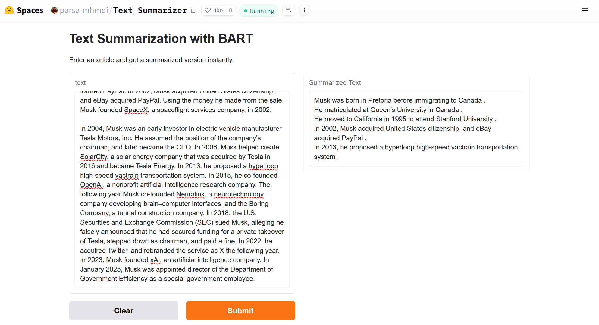

# 📚 Text Summarization with BART  

### 🚀 A Deep Learning Project for Abstractive Text Summarization using `facebook/bart-base`

## 📌 **Project Overview**
This project fine-tunes the **BART (Bidirectional and Auto-Regressive Transformer)** model on the **CNN/DailyMail** dataset to perform **abstractive text summarization**. The model was trained for **3 epochs**, achieving a final **loss of 0.97**.  

💡 **Try the live demo here** 👉 [Hugging Face Space](https://huggingface.co/spaces/parsa-mhmdi/Text_Summarizer) 



---

## 🛠 **Approach**
### 🔹 **1. Data Processing**
- We use the **CNN/DailyMail dataset**, which consists of **news articles** and their **human-written summaries**.
- The text is tokenized using the **BART tokenizer** and converted into **model-friendly input tensors**.

### 🔹 **2. Model Selection**
- We fine-tuned the **`facebook/bart-base`** model, which is a transformer-based seq2seq model specifically optimized for summarization.
- To make training faster and more efficient, we used **`sshleifer/distilbart-cnn-6-6`**, a distilled version of BART.

### 🔹 **3. Training Optimizations**
- **Gradient Checkpointing**: Reduces memory usage.
- **8-bit AdamW Optimizer**: Uses `bitsandbytes` for efficiency.
- **Mixed Precision (`fp16`)**: Reduces GPU memory load.
- **Training on a Smaller Subset**: Limited training to 5K samples for speed.

### 🔹 **4. Evaluation**
- The model generates summaries for unseen test articles, which are compared to human-written summaries.

### 🔹 **5. Deployment**
- The trained model is deployed as a **Gradio-based web app** on **Hugging Face Spaces**.

---

## 📂 **Repository Files**
The project repository contains the following essential files:

| File Name                  | Description |
|----------------------------|-------------|
| `.gitattributes`           | Git LFS settings for handling large model files. |
| `README.md`                | Project documentation (this file). |
| `app.py`                   | Python script for launching the Gradio web app. |
| `config.json`              | Model configuration file. |
| `generation_config.json`   | Generation settings for text summarization. |
| `merges.txt`               | Tokenizer merges file. |
| `model.safetensors`        | The trained BART model weights (920 MB, stored with Git LFS). |
| `requirements.txt`         | List of dependencies required to run the project. |
| `special_tokens_map.json`  | Special token configurations for the tokenizer. |
| `tokenizer.json`           | Tokenizer model used for text processing. |
| `tokenizer_config.json`    | Tokenizer settings and configurations. |
| `vocab.json`               | Vocabulary file for tokenization. |
| `image.jpg`                | Screenshot of the model output. |

---

## 📊 **Dataset: CNN/DailyMail**
The **CNN/DailyMail dataset** is a widely used dataset for text summarization, containing:
- **220K+ articles** from CNN and Daily Mail.
- Corresponding **human-written summaries** (highlights).
- Used extensively in **abstractive summarization tasks**.

Dataset source: [Hugging Face Datasets](https://huggingface.co/datasets/cnn_dailymail)

### **Dataset Processing**
1. **Tokenization**  
   - Articles and summaries are tokenized using the **BART tokenizer**.
   - Articles are truncated at **1024 tokens**; summaries at **128 tokens**.
  
2. **Filtering and Formatting**  
   - Unnecessary columns are removed.
   - The processed dataset is uploaded to the Hugging Face Hub.

---

## 🏋️‍♂️ **Model Training**
- **Model Used**: `sshleifer/distilbart-cnn-6-6` (Distilled version of `facebook/bart-base`)
- **Fine-tuned on**: CNN/DailyMail dataset
- **Training Epochs**: `3`
- **Final Loss Achieved**: `0.97`
- **Optimizer**: AdamW (8-bit optimized for speed)
- **Batch Size**: `64`
- **Precision**: Mixed precision (`fp16`) for better performance
- **Logging**: TensorBoard (`./tensorboard_logs`)

---

## 🖥️ **Key Code Components**
### **1️⃣ Loading the Dataset**
```python
from datasets import load_dataset
dataset = load_dataset("cnn_dailymail", "3.0.0")
